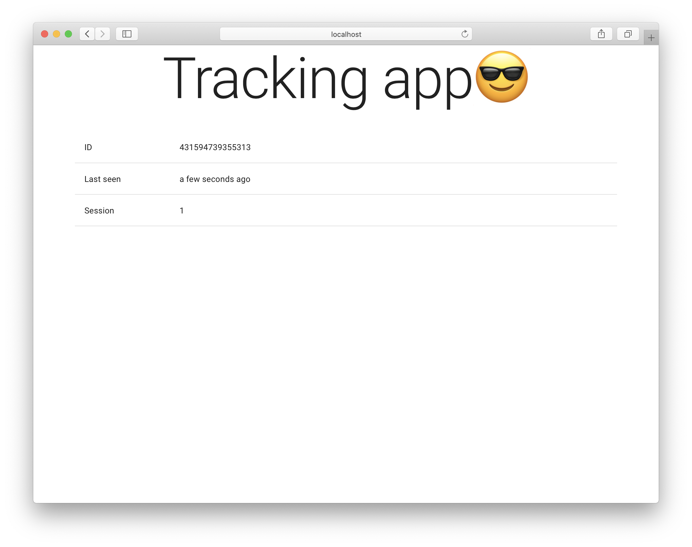

# Tracker Forntend

Personal experiments with using Etag for user tracking.

<p align="center">
  
</p>

## Installation

```bash
# Install deps
$ yarn

# Create env file and check its
$ cp ./env.example ./env

# Laaunch project
$ yarn start
```

## Other commands

```bash
# Lint project
$ yarn lint
```
